# Hybrid Cloud Connectivity with Transit Gateway and Site-to-Site VPN

## Project Overview

A hybrid AWS network architecture connecting an on-premises environment to multiple AWS VPCs using AWS Transit Gateway and Site-to-Site VPN.

The architecture uses Transit Gateway as the central network hub connecting Dev, Staging, and Prod VPCs. Site-to-Site VPN provides hybrid connectivity using IKEv2 and BGP dynamic routing. Route 53 Resolver provides hybrid DNS resolution, while AWS RAM supports Transit Gateway sharing and Network Firewall provides centralized traffic inspection.

CloudTrail and AWS Config are used to audit and record network configuration changes.

---

# Architecture

---

# Network Architecture

The project uses three isolated VPC environments with non-overlapping CIDR ranges.

| Environment | VPC CIDR | Subnets |
|---|---|---|
| Dev | `10.10.0.0/16` | `10.10.1.0/24`, `10.10.2.0/24` |
| Staging | `10.20.0.0/16` | `10.20.1.0/24` |
| Prod | `10.30.0.0/16` | `10.30.1.0/24` |

Transit Gateway provides centralized connectivity between the VPCs and the Site-to-Site VPN connection.

---

# Workflow

1. Three isolated VPCs are created for Dev, Staging, and Prod.
2. AWS Transit Gateway is deployed as the central network hub.
3. VPC attachments connect the three VPCs to the Transit Gateway.
4. A Customer Gateway is configured for the on-premises environment.
5. A Site-to-Site VPN connection is created between AWS and the on-premises environment.
6. VPN tunnels use IKEv2 and BGP for dynamic routing.
7. Transit Gateway route tables control traffic between the VPCs and VPN attachment.
8. Route 53 Resolver inbound and outbound endpoints provide hybrid DNS resolution.
9. AWS RAM is configured to support Transit Gateway sharing.
10. Network Firewall provides centralized traffic inspection.
11. CloudTrail records network-related API activity.
12. AWS Config records resource configuration changes.

---

# AWS Services Used

## Amazon VPC

Used to create isolated environments for:

- Dev
- Staging
- Prod

CIDR ranges were planned to avoid overlapping networks.

## AWS Transit Gateway

Used as the central network hub.

Connects:

- Dev VPC
- Staging VPC
- Prod VPC
- Site-to-Site VPN

Transit Gateway route tables and attachments provide centralized routing.

## AWS Site-to-Site VPN

Provides hybrid connectivity between AWS and the on-premises environment.

Configured with:

- Customer Gateway
- IKEv2
- BGP
- AWS and customer ASNs
- Two VPN tunnels

The VPN tunnels remain down because no physical or software-based on-premises VPN device is connected to terminate the tunnels.

## Amazon Route 53 Resolver

Configured with:

- Inbound Resolver endpoint
- Outbound Resolver endpoint

Used to support DNS resolution between AWS and an on-premises environment.

## AWS Resource Access Manager

Used to support sharing the Transit Gateway across AWS accounts and organizations.

## AWS Network Firewall

Provides centralized network traffic inspection for:

- Inter-VPC traffic
- Egress traffic
- East-west traffic filtering

## AWS CloudTrail

Used to audit API activity and network configuration changes.

## AWS Config

Used to record AWS resource configuration changes and maintain configuration history.

## AWS Direct Connect

Considered as an alternative to Site-to-Site VPN for hybrid connectivity.

Direct Connect provides a dedicated private connection with more predictable network performance, while Site-to-Site VPN provides a faster and generally lower-cost internet-based connection.

---

# Screenshots

## VPC - Dev

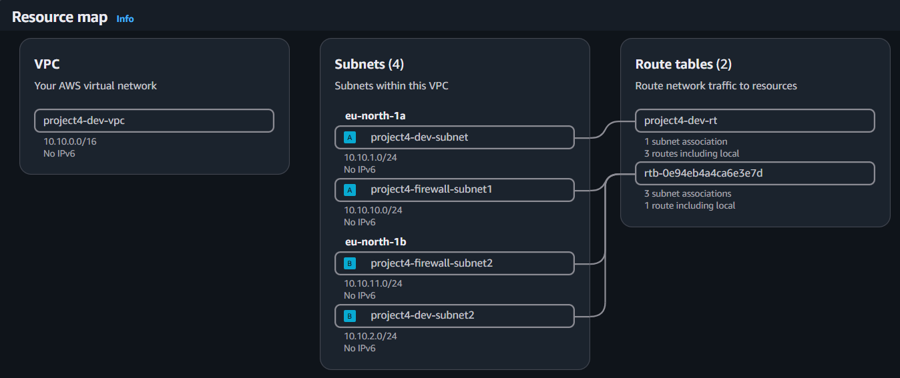

## VPC - Prod

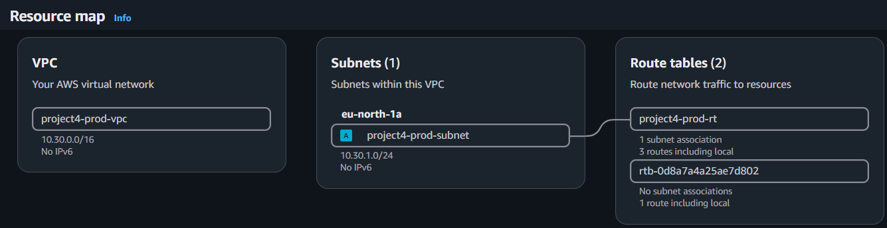

## VPC - Staging

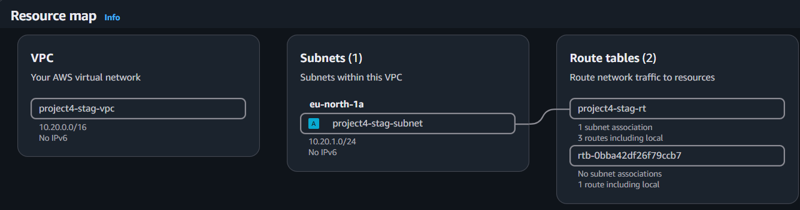

## Resolver Security Group

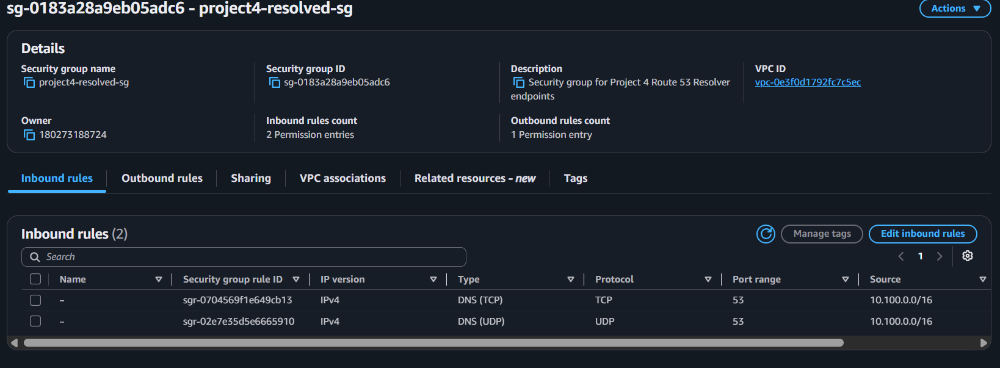

## Transit Gateway

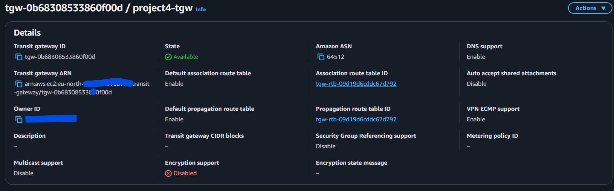

## Transit Gateway Attachments

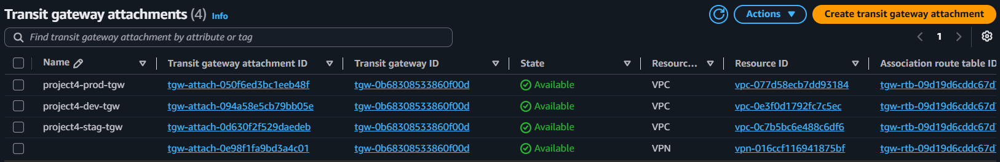

## Transit Gateway Route Tables

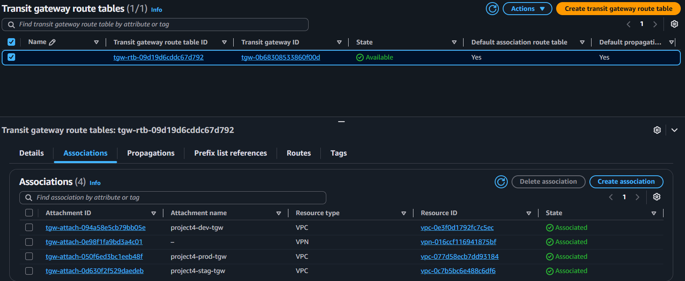

## Site-to-Site VPN

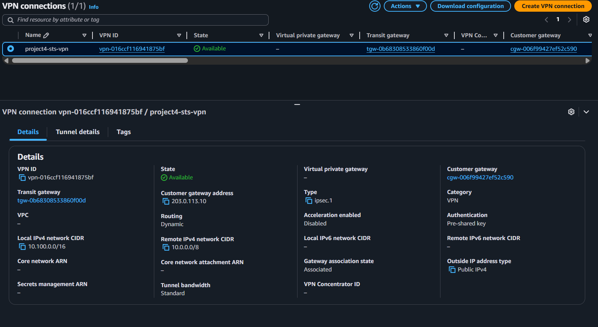

## Customer Gateway

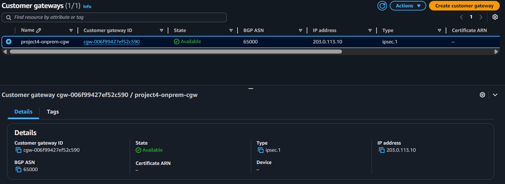

## Network Firewall

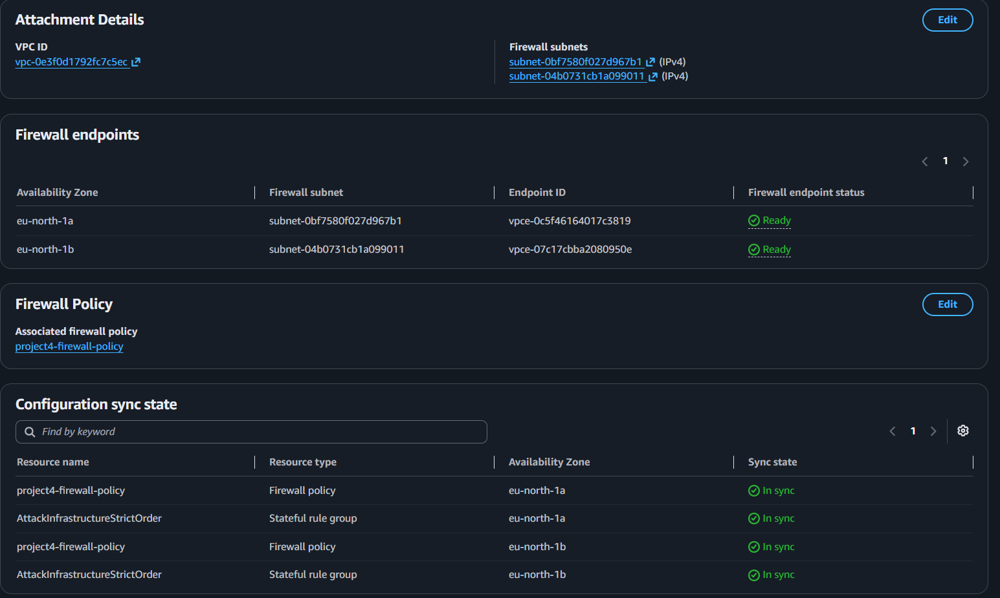

## AWS Resource Access Manager

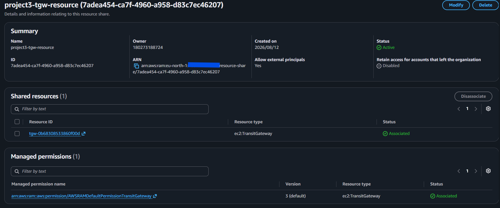

## Route 53 Resolver - Inbound

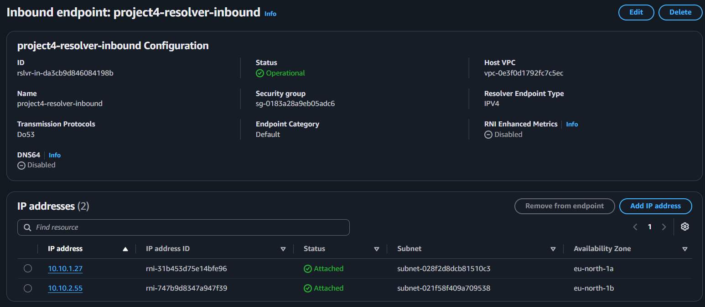

## Route 53 Resolver - Outbound

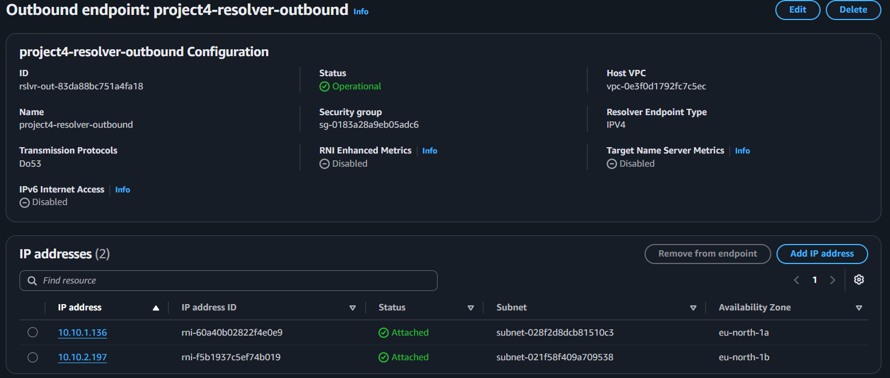

## AWS Config

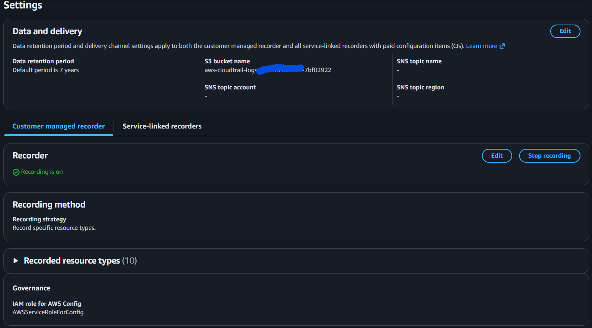

## AWS CloudTrail

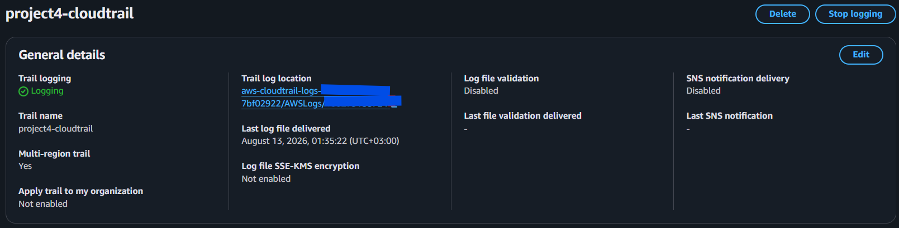

---

# Skills Demonstrated

- Hybrid Cloud Architecture
- Multi-VPC Network Design
- AWS Transit Gateway
- AWS Site-to-Site VPN
- Customer Gateway Configuration
- IKEv2 VPN Configuration
- BGP Dynamic Routing
- Transit Gateway Route Tables
- Route 53 Resolver
- Hybrid DNS Architecture
- AWS Resource Access Manager
- AWS Network Firewall
- AWS CloudTrail
- AWS Config
- Direct Connect vs VPN Architecture
- CIDR Planning
